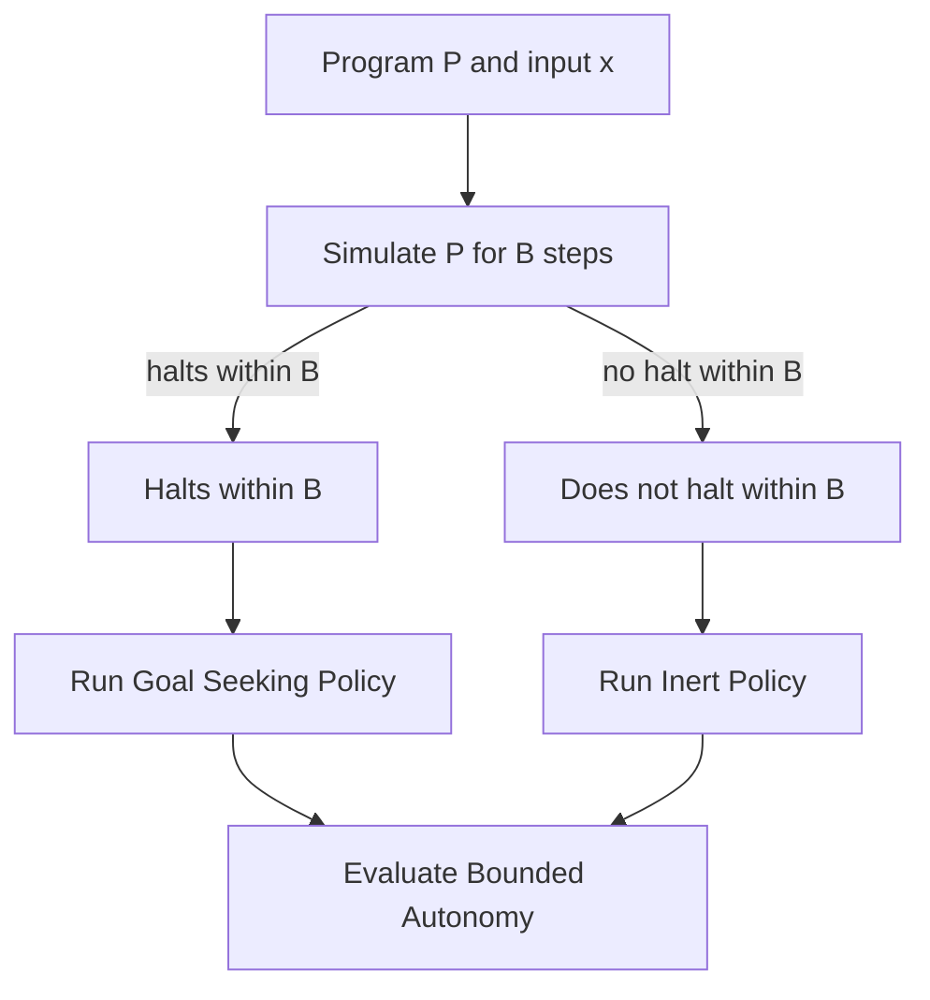

[](https://github.com/bradsaucier/autonomy-undecidability/actions/workflows/quality_gate.yml)
[](LICENSE)

# Computational Autonomy and Undecidability

## 1. Mission Overview

Objective: Demonstrate the theoretical limits of verifying autonomous software using an executable bounded reduction.

Why this matters: Modern autonomous systems, from robotics to safety critical AI, cannot rely on a universal algorithm that proves they will always behave safely for all time and all inputs. This repository shows, in executable form, why that guarantee is mathematically blocked at the unbounded level and how real systems fall back to bounded checks and constrained models instead.

Rice's Theorem dictates that nontrivial semantic properties of program behavior are undecidable. Modeling Computational Autonomy as such a property means no universal algorithm can decide it for all programs and all inputs.

This repository provides an executable bounded illustration of a reduction from the Halting Problem to a simplified autonomy property. You can run the demo, observe the branch on bounded halting behavior, and trace the logic in both code and supporting theory.

Constraints:

- Bounded execution only: all simulations run under an explicit step bound B.
- No halting solver: this code does not decide the Halting Problem. It illustrates why unbounded autonomy guarantees are out of reach while bounded checks remain decidable.

Time on target:

- 2 to 5 minutes: run the quick start cases.
- 15 to 30 minutes: read the reduction code and map it to the diagram.
- 60 to 120 minutes: study the theory notes.

Prerequisites:

- Comfortable with basic Python tooling (virtual environments, pip).
- Familiarity with Turing machines, the Halting Problem, and decidability.
- Able to follow a standard many-one reduction argument.

## 2. Capability Profile

This project distinguishes two levels of autonomy reasoning:

- Computational Autonomy  
  The unbounded semantic property: for all time and all inputs, the agent always achieves the objective while remaining safe. This is an undecidable property in the sense of Rice's Theorem.

- Bounded Autonomy  
  The finite, operational property implemented here: given explicit bounds, does the constructed controller both stay safe and reach the goal within those limits. This bounded property is decidable.

The code implements a bounded reduction pattern:

- Input: program P, input x, and step bound B.
- Mechanism: simulate P(x) for B steps, then select a policy based on the bounded halting outcome.
- Outcome: the Bounded Autonomy result in the grid world is tied directly to whether P(x) halts within B.

This pattern mirrors how real systems secure guarantees in practice: under time limits, finite models, and explicit constraints.

## 3. Concept of Operations

### 3.1 Bounded reduction pattern

The software implements a standard many-one reduction structure in bounded form.

Decision problems in this demo:

1. Bounded halting  
   Given P, x, and step bound B: does P(x) halt within B steps.

2. Bounded autonomy  
   Given the constructed controller and environment: does the agent remain safe and reach the goal within finite limits.

Reduction plan:

1. Controller executes a bounded simulation of P(x) with limit B steps.
2. HALT detected within B: engage Goal Seeking Policy.
3. TIMEOUT at B without halting: engage Inert Policy that fails liveness by design.
4. Environment runs a finite episode and evaluates the Bounded Autonomy property.

Autonomy evaluation criteria:

- Safety: the agent never enters a hazard cell.
- Liveness: the agent reaches a goal cell within max_steps and emits a success signal.

Policies:

- Goal Seeking Policy: a simple greedy controller tuned to the fixed environment that attempts to reach the goal while staying out of hazards.
- Inert Policy: an inert controller that does not make progress and fails liveness by design while remaining safe.

### 3.2 Autonomy terminology

This project uses the following key terms:

1. Semantic property  
   A property of what a program computes or how it behaves, not how its source code is written.

2. Computational Autonomy  
   The theoretical, unbounded semantic property: the agent always achieves the objective safely across all time and all inputs. Undecidable by Rice's Theorem.

3. Bounded Autonomy  
   The operational property implemented by this demo: under explicit bounds (simulation bound B and episode bound max_steps), the agent remains safe and reaches the goal.

You can state the relationship as:

- There is no universal procedure that decides Computational Autonomy for arbitrary programs.
- This repository implements an exact bounded check for Bounded Autonomy tied to a bounded halting condition.

### 3.3 Visual flow



Text fallback:

- Input P and x.
- Simulate P(x) for B steps.
- If P(x) halts within B, select Goal Seeking Policy.
- If P(x) does not halt within B, select Inert Policy.
- Run the controller in the grid world and evaluate Bounded Autonomy.

Simulation and branch selection are both decidable and fully implemented. The undecidability enters only when you lift the bounds and ask for a universal procedure over all programs and all time.

## 4. Execution - Quick start

Run these steps in a clean Python environment.

### 4.1 Create a virtual environment

```bash
python3 -m venv .venv
source .venv/bin/activate
```

Windows PowerShell:

```powershell
python -m venv .venv
.\.venv\Scripts\Activate.ps1
```

### 4.2 Install for users

```bash
pip install .
```

### 4.3 Install for development

Use this when you want to run tests, type checks, and linters:

```bash
pip install -e ".[dev]"
```

Windows PowerShell variant:

```powershell
pip install -e ".[dev]"
```

### 4.4 Run a bounded halting case

```bash
autonomy-demo --program halt --x 10 --bound 200 --max-steps 60 --render
```

This simulates a program that halts. The controller selects the Goal Seeking Policy and attempts to reach the goal safely.

### 4.5 Run a non halting case under the same bound

```bash
autonomy-demo --program loop --x 10 --bound 200 --max-steps 60 --render
```

This simulates a program that loops. The controller selects the Inert Policy and does not reach the goal.

### 4.6 Example outputs

Halting case (success=True)

```text
$ autonomy-demo --program halt --x 10 --bound 200 --max-steps 60 --render
.....
....A
....G
.....
.....

safe=True
success=True
steps=8
```

Non halting case (success=False)

```text
$ autonomy-demo --program loop --x 10 --bound 200 --max-steps 60 --render
safe=True
success=False
steps=20
```

Exact grids and step counts may differ with configuration, but the pattern should match: halting runs reach the goal under the bound, non halting runs remain inert and fail liveness.

## 5. CLI reference

### 5.1 Console script

```bash
autonomy-demo --program halt --x 10 --bound 200 --max-steps 60 --render
```

### 5.2 Module invocation

```bash
python -m computational_autonomy.cli --program halt --x 10 --bound 200 --max-steps 60 --render
```

### 5.3 Argument summary

- --program  
  Selects a sample machine program, for example halt or loop.

- --x  
  Input value to the machine program.

- --bound  
  Step bound B for the bounded machine simulation. If P(x) has not halted after B steps, the simulation reports a timeout, not a proof of non halting.

- --max-steps  
  Maximum episode length for the environment run. This is separate from --bound. The machine may halt early while the episode continues for additional steps, or the inert policy may use all available steps without reaching the goal.

- --render  
  Optional flag to render a textual view of the grid environment and agent movement.

In short:

- --bound controls how long you trust the simulated program P(x) before treating it as a timeout.
- --max-steps controls how long you let the agent act in the environment before declaring failure on liveness.

Environment note:

- build_default_environment() builds the fixed 5x5 grid. CLI flags do not change the grid size or layout.

## 6. Repository map

### 6.1 Code path

- src/computational_autonomy/machine.py  
  Defines the machine model, sample programs, and the bounded simulation API.

- src/computational_autonomy/reduction.py  
  Runs the machine once, then selects the Goal Seeking or Inert policy based on bounded halting behavior.

- src/computational_autonomy/environment.py  
  Defines the grid, hazards, goals, and the checks used for safety and liveness.

- src/computational_autonomy/cli.py  
  Wires the simulation together and exposes the autonomy-demo entry point.

### 6.2 Theory path

- [start_here.md](start_here.md)  
  Entry point for the theory sequence.

- [theory/definitions.md](theory/definitions.md)  
  Project definitions and terminology.

- [theory/proof_note.md](theory/proof_note.md)  
  Proof sketch connecting Rice's Theorem, the halting reduction, and Computational Autonomy.

## 7. Theoretical foundation

### 7.1 Rice's Theorem

Rice's Theorem states that any nontrivial semantic property of partial computable functions is undecidable. Once Computational Autonomy is framed as a semantic property of program behavior, it falls under this limit.

### 7.2 Reduction argument

A standard many one reduction uses two witness programs: one that satisfies the target property and one that does not. Given P and x, construct Q that behaves like the positive witness if P halts on x, and like the negative witness otherwise. If a decider existed for the property of Q, it would decide halting for P, which is impossible.

This repository mirrors that construction in bounded form:

- Machine simulation encodes the halting witness.
- Policy selection encodes the branch on the bounded halting outcome.
- Environment evaluation encodes the Bounded Autonomy decision.

The proof of undecidability for full Computational Autonomy lives in the theory notes. The code shows the reduction pattern under explicit bounds.

## 8. Practical implications

This work blocks a universal, unbounded checker for Computational Autonomy. It does not block strong guarantees under constraints.

In practice, assurance for autonomous systems comes from:

- Time limits and watchdog bounds.
- Finite state abstractions and restricted models.
- Contract based reasoning and compositional proofs.
- Targeted verification of specific Bounded Autonomy properties.

The demo reflects this reality. It implements an exact bounded check that is informative while remaining consistent with undecidability limits at the unbounded level.

### 8.1 What this is not

This project is not:

- A safety certification tool for real autonomous systems.
- A general purpose verifier for arbitrary autonomy properties.
- A production grade environment or reinforcement learning framework.
- A halting solver or a workaround for Rice's Theorem.

It is a focused, didactic demonstration of how a reduction from halting to an autonomy style property works and why any attempt to universalize that procedure runs into undecidability.

## 9. Verification

Run the local checks:

```bash
ruff check .
ruff format --check .
mypy src
pytest --cov
```

These commands enforce style, basic static typing, and test coverage for the core logic.

## 10. Troubleshooting

1. No output appears  
   Confirm the virtual environment is active and that pip install . or pip install -e ".[dev]" completed without errors.

2. CLI entry point not found  
   Reinstall in editable mode:

   ```bash
   pip install -e ".[dev]"
   ```

3. Movement seems unexpected  
   Confirm you are using the default environment settings. The grid topology is fixed by build_default_environment().

4. Runs take longer than expected  
   Lower --max-steps and --bound to control workload.

## 11. FAQ

Q: Does this mean meaningful autonomy guarantees are impossible?  
A: No. It means there is no universal unbounded procedure that decides Computational Autonomy for all programs. Within bounded models and constrained settings, you can still obtain strong, useful guarantees.

Q: Why does the code use a toy grid world?  
A: The grid world keeps the environment finite, repeatable, and easy to inspect. That makes the reduction pattern visible without the noise of a full robotics or simulation stack.

Q: Can I adapt this pattern to my own system?  
A: You can adapt the idea of separating Computational Autonomy from Bounded Autonomy and making bounds explicit. Any adaptation must still respect undecidability at the unbounded level.

Q: Does the bounded simulation approximate a halting oracle?  
A: No. It implements an exact bounded check: halting within B steps versus no halt within B steps yet. That distinction is central to the design.

## 12. Provenance and disclaimer

Author: Bradley Saucier  
Status: personal academic work for research and learning.

This repository does not represent any employer, agency, or government organization. External contributions are not being solicited at this time.
