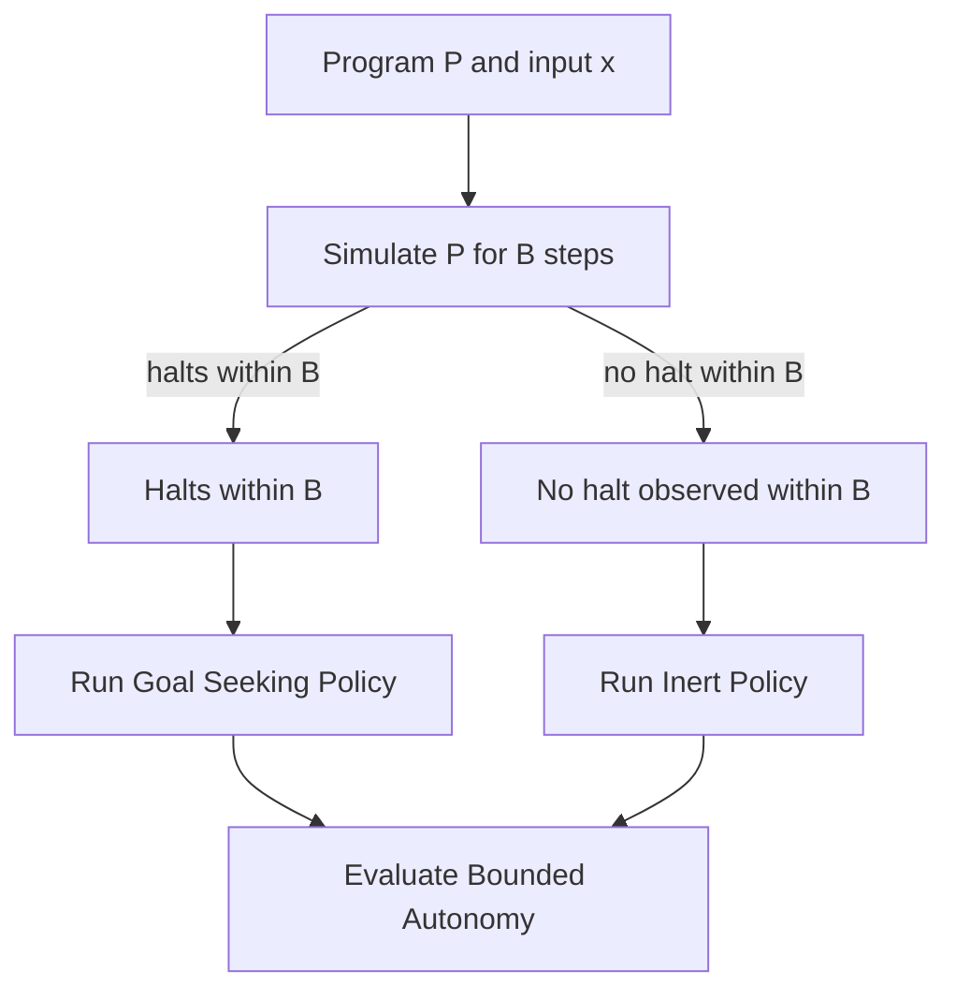

[](https://github.com/bradsaucier/autonomy-undecidability/actions/workflows/quality_gate.yml)
[](LICENSE)

# Computational Autonomy and Undecidability

> [!IMPORTANT]
> BLUF: This repo demonstrates the reduction pattern in runnable form under explicit bounds. It does not solve the Halting Problem, and it is not a safety certification tool for real autonomous systems.

## Mission dashboard

| Item               | Status                                                                                                                |
|--------------------|-----------------------------------------------------------------------------------------------------------------------|
| Primary objective  | Illustrate the theoretical limits of verifying autonomous software by enacting a bounded reduction.                   |
| Core claim         | If "full computational autonomy" is modeled as a nontrivial semantic property of program behavior, then no algorithm can decide it for all programs and inputs (Rice's Theorem). |
| What is implemented| Exact bounded checks only: "halts within B steps" and "bounded autonomy within max-steps."                            |
| What is not        | Any unbounded decider for halting or autonomy.                                                                        |
| Runtime            | Python 3.10+ (CI runs 3.10, 3.11, 3.12). Repo defaults to Python 3.12 via `.python-version`.                         |
| Fastest install    | `uv` workflow (matches CI).                                                                                           |

## Mission overview (first 60 seconds)

Objective - Illustrate the theoretical limits of verifying autonomous software by enacting a bounded reduction.

Core claim - If "full computational autonomy" is modeled as a nontrivial semantic property of program behavior, then no algorithm can decide it for all programs and inputs (Rice's Theorem). This repo shows the reduction pattern in runnable form, then makes the bounds explicit.

What you will do here - Run a small Python demo that:
1) Simulates a toy program `P(x)` for at most `B` steps (bounded halting check).
2) Chooses one of two controller policies based on that bounded outcome.
3) Runs a finite grid-world episode and reports whether the agent was safe and reached the goal (bounded autonomy check).

## Choose your path (hub and spoke)

| If your mission is                      | Go to                                             |
|-----------------------------------------|---------------------------------------------------|
| Run it now                              | [Execution](#execution---quick-start)             |
| Trace the reduction (theory to code)    | [Concept of operations](#concept-of-operations-conops) |
| Audit scope and limits (skeptic mode)   | [Scope and constraints](#scope-and-constraints)   |
| Read the proof sketch                   | [Theory notes](#theory-notes)                     |
| Navigate the codebase                   | [Repository map](#repository-map)                 |

## SMEAC map (operator navigation)

| SMEAC element          | In this README                                     |
|------------------------|----------------------------------------------------|
| Situation              | Mission overview, scope and constraints            |
| Mission                | Capability profile (what is checked, and what is not) |
| Execution              | Quick start, CLI reference, interpreting outputs   |
| Admin and logistics    | Requirements, verification, troubleshooting        |
| Command and signal     | Provenance and disclaimer                          |

## Scope and constraints

This README is a funnel, not a filter. Two statements are non-negotiable:

1) This repository does not solve the Halting Problem.
   a) It implements an exact bounded check: "halts within B steps" vs "has not halted within B steps yet."

2) This repository is not a safety certification tool for real autonomous systems.
   a) The environment is a fixed toy grid world to make the reduction structure inspectable.
   b) Any language about "autonomy" is computational and semantic, not a claim about real-world operational safety.

What you can verify here (bounded):
1) Given a chosen witness program and input, whether `P(x)` halts within `B` steps.
2) Given the constructed controller and a finite episode limit, whether the agent stays safe and reaches the goal (bounded autonomy check).

What you cannot verify here (unbounded):
1) Whether an arbitrary program halts (full halting).
2) Whether an arbitrary agent is safe and reaches the goal for all time and all inputs (full computational autonomy).

> [!IMPORTANT]
> Non-affiliation: This is personal academic work. It is not affiliated with, endorsed by, funded by, or representative of any employer, government organization, or agency. See [DISCLAIMER.md](DISCLAIMER.md).

## Execution - Quick start

The CI pipeline uses `uv` for reproducible installs and runs. The fastest path is to match CI.

### Option A (recommended) - `uv` workflow (matches CI)

1) Install `uv`:
```bash
curl -LsSf https://astral.sh/uv/install.sh | sh
```

2) Create a locked environment and install (dev tools optional):
```bash
uv sync
uv sync --dev
```

3) Run the two canonical cases:
```bash
uv run autonomy-demo --program halt --x 10 --bound 200 --max-steps 60 --render
uv run autonomy-demo --program loop --x 10 --bound 200 --max-steps 60 --render
```

> [!NOTE]
> Loop case nuance: For the provided `loop` witness, the correct bounded outcome is "did not halt within B steps." For an arbitrary program, "did not halt within B steps" is a timeout observation, not a proof of infinite looping.

### Option B (fallback) - classic `venv` + `pip`

Unix:
```bash
python3 -m venv .venv
source .venv/bin/activate
pip install .
autonomy-demo --program halt --x 10 --bound 200 --max-steps 60 --render
```

Windows PowerShell:
```powershell
python -m venv .venv
.\.venv\Scripts\Activate.ps1
pip install .
autonomy-demo --program halt --x 10 --bound 200 --max-steps 60 --render
```

If activation fails due to ExecutionPolicy:
```powershell
Set-ExecutionPolicy -ExecutionPolicy Bypass -Scope Process
```

Development install (pip):
```bash
pip install -e ".[dev]"
```

## How to interpret outputs

The CLI prints three summary lines:

| Field             | Meaning                                                                                                                                            |
|------------------|-----------------------------------------------------------------------------------------------------------------------------------------------------|
| `safe=True|False` | True means the agent never entered a hazard cell.                                                                                                  |
| `success=True|False` | True means the agent reached the goal and emitted the success signal. In this reduction, `success=True` is expected for a halting witness (within bounds). `success=False` is expected for a non-halting or timeout witness (within bounds), because the inert policy fails liveness by design. |
| `steps=<int>`     | The number of environment ticks executed before termination.                                                                                         |

> [!IMPORTANT]
> Important nuance:
> 1) `success=False` does not distinguish "infinite loop" from "halts after B+1 steps."
> 2) It indicates only "no halting was observed within the bound."

Example pattern (your exact grids and step counts may differ):
```text
safe=True
success=True
steps=8
```

## Capability profile

This project distinguishes two levels of autonomy reasoning:

| Level                      | Decision question                                                                 | Implemented here              |
|---------------------------|-----------------------------------------------------------------------------------|-------------------------------|
| Bounded halting            | Given `P`, `x`, and step bound `B`: does `P(x)` halt within `B` steps             | Yes                           |
| Bounded autonomy           | Given the constructed controller and environment: does the agent remain safe and reach the goal within finite limits | Yes |
| Unbounded computational autonomy | The agent always achieves the objective safely across all time and inputs    | No (target of the theory claim) |

The theoretical target is "computational autonomy" as an unbounded semantic property. The executable artifact is the bounded version above.

## Concept of operations (CONOPS)

### Reduction plan (operational description)

1) Input `P` and `x`.
2) Simulate `P(x)` for `B` steps.
3) If `P(x)` halts within `B`, select Goal Seeking Policy.
4) If `P(x)` does not halt within `B`, treat that as a timeout at the bound and select Inert Policy (fails liveness by design).
5) Run the controller in the grid world for at most `max-steps` and evaluate bounded autonomy.

Bounded simulation and policy selection are decidable and fully implemented. The undecidability enters only when you lift the bounds and ask for a universal procedure over all programs and all time.

### Visual flow



### Key terminology (plain language, then tight)

<details>
<summary>Open terminology</summary>

Undecidability (plain):
A problem is undecidable if no program can solve it correctly for every possible input. This is not "slow" or "hard." It is impossible in principle.

Undecidability (tight):
A language `L` is undecidable if there is no Turing machine that halts on all inputs and correctly decides membership in `L`.

Rice's Theorem (plain):
You cannot build a universal static checker that decides nontrivial behavioral properties of programs. If the property depends on what the program does (not how it is written), and it is true for some programs but not all, then there is no general decider.

Rice's Theorem (tight):
For any nontrivial set of partial computable functions `S` (neither empty nor all of them), the problem of deciding whether a given program computes a function in `S` is undecidable.

Many-one reduction (plain):
A reduction converts instances of one problem into instances of another. If you could solve the second, you could solve the first. If the first is impossible, the second must also be impossible.

Many-one reduction (tight):
`A <=m B` if there exists a computable function `f` such that for all strings `w`, `w in A` iff `f(w) in B`.

Semantic property (plain):
A property about what a program does (its behavior), not the exact source code text.

Computational autonomy (this repo's usage):
The unbounded semantic property: the agent always achieves the objective safely across all time and inputs. Undecidable by Rice's Theorem when formalized as a nontrivial semantic property.

Bounded autonomy (this repo's implementation):
The operational property checked by this demo: under explicit bounds (`B` and `max-steps`), the agent remains safe and reaches the goal.

</details>

## Theory to code traceability (claim - location - observation)

Use this to connect the math story to concrete artifacts.

| Claim or artifact                                      | Where in code                                  | What you can observe                                                                 |
|-------------------------------------------------------|------------------------------------------------|--------------------------------------------------------------------------------------|
| Bounded halting check: halt within B vs timeout at B   | `src/computational_autonomy/machine.py`        | `--bound B` affects whether the controller branches to goal-seeking vs inert         |
| Reduction branch (policy selection)                   | `src/computational_autonomy/reduction.py`      | Halting witness within bound tends to produce `success=True`; timeout within bound tends to produce `success=False` |
| Safety and liveness evaluation                         | `src/computational_autonomy/environment.py`    | CLI prints `safe=...`, `success=...`, `steps=...`                                    |
| CLI wiring and defaults                                | `src/computational_autonomy/cli.py`            | Defaults: `x=10`, `bound=200`, `max-steps=60`                                        |

## Execution details (CLI reference)

Console script:
```bash
autonomy-demo --program halt --x 10 --bound 200 --max-steps 60 --render
```

Module invocation:
```bash
python -m computational_autonomy.cli --program halt --x 10 --bound 200 --max-steps 60 --render
```

Argument summary (high signal):

| Argument      | Purpose                                 | Notes                                 |
|--------------|------------------------------------------|---------------------------------------|
| `--program`  | selects a sample machine program         | for example `halt` or `loop`          |
| `--x`        | input value to the machine program       | integer                               |
| `--bound`    | step bound `B` for the machine simulation| timeout at `B` is not proof of non-halting |
| `--max-steps`| maximum episode length for the environment run | separate from `--bound`         |
| `--render`   | prints a textual view of the grid environment and agent movement | operator visualization |

In short:
1) `--bound` controls how long you trust the simulated `P(x)` before treating it as a timeout.
2) `--max-steps` controls how long you let the agent act in the environment before declaring failure on liveness.

## Repository map

| Area                          | Path                                       | Purpose                                                                 |
|------------------------------|--------------------------------------------|-------------------------------------------------------------------------|
| Machine model and bounded simulation | `src/computational_autonomy/machine.py` | machine model, sample programs, bounded simulation API                  |
| Reduction logic              | `src/computational_autonomy/reduction.py`  | runs the machine once, selects goal-seeking or inert policy             |
| Environment                  | `src/computational_autonomy/environment.py`| grid, hazards, goals, safety and liveness checks                        |
| CLI                          | `src/computational_autonomy/cli.py`        | wires everything and exposes `autonomy-demo`                            |
| Theory entry point           | [start_here.md](start_here.md)             | entry point for the theory sequence                                     |
| Definitions                  | [theory/definitions.md](theory/definitions.md) | project definitions and terminology                               |
| Proof sketch                 | [theory/proof_note.md](theory/proof_note.md) | proof sketch connecting Rice's Theorem, halting reduction, and computational autonomy |

## Theory notes

### Rice's Theorem

Rice's Theorem states that any nontrivial semantic property of partial computable functions is undecidable. Once computational autonomy is framed as a semantic property of program behavior, it falls under this limit.

### Reduction argument (why halting shows up)

A standard many-one reduction uses two witness programs: one that satisfies the target property and one that does not. Given `P` and `x`, construct `Q` that behaves like the positive witness if `P` halts on `x`, and like the negative witness otherwise. If a decider existed for the property of `Q`, it would decide halting for `P`, which is impossible.

This repository mirrors that construction in bounded form:
1) Machine simulation encodes the halting witness (bounded).
2) Policy selection encodes the branch on the bounded halting outcome.
3) Environment evaluation encodes the bounded autonomy decision.

## Practical implications

This work blocks a universal, unbounded checker for computational autonomy. It does not block strong guarantees under constraints.

In practice, assurance for autonomous systems comes from:
1) Time limits and watchdog bounds.
2) Finite state abstractions and restricted models.
3) Contract-based reasoning and compositional proofs.
4) Targeted verification of specific bounded properties.

## Verification (local quality gate)

CI runs:
1) `ruff check .` and `ruff format --check .`
2) `mypy src` (strict)
3) `pytest --cov` with coverage gate at 85 percent

Run locally with `uv`:
```bash
uv sync --dev
uv run ruff check .
uv run ruff format --check .
uv run mypy src
uv run pytest --cov
```

Run locally with `pip`:
```bash
pip install -e ".[dev]"
ruff check .
ruff format --check .
mypy src
pytest --cov
```

## Troubleshooting

| Symptom                   | Check                               | Corrective action                              |
|--------------------------|--------------------------------------|------------------------------------------------|
| No output appears         | environment active, install completed| re-run install, then rerun `autonomy-demo`     |
| CLI entry point not found | package not installed in environment | `pip install -e ".[dev]"`                      |
| Movement seems unexpected | environment settings                 | confirm default environment via `build_default_environment()` |
| Runs take longer than expected | bounds too high                  | lower `--max-steps` and `--bound`              |

## FAQ

<details>
<summary>Q: Does this mean meaningful autonomy guarantees are impossible?</summary>

A: No. It means there is no universal unbounded procedure that decides computational autonomy for all programs. Within bounded models and constrained settings, you can still obtain strong, useful guarantees.

</details>

<details>
<summary>Q: Why does the code use a toy grid world?</summary>

A: The grid world keeps the environment finite, repeatable, and easy to inspect. That makes the reduction pattern visible without the noise of a full robotics or simulation stack.

</details>

<details>
<summary>Q: Does the bounded simulation approximate a halting oracle?</summary>

A: No. It implements an exact bounded check: halting within `B` steps versus no halt within `B` steps yet. That distinction is central to the design.

</details>

## Provenance and disclaimer

Author - Bradley Saucier
Status - personal academic work for research and learning.

This repository does not represent any employer, agency, or government organization. See [DISCLAIMER.md](DISCLAIMER.md).
